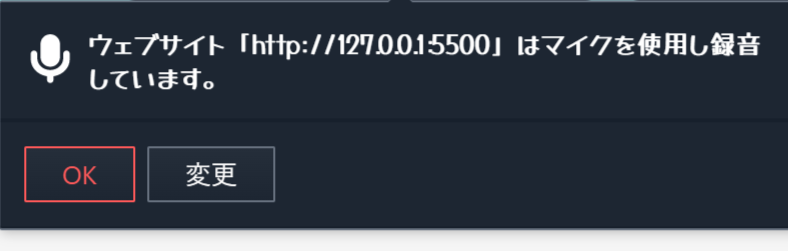

## Aizuchi-AI-App Kendea-Edition

貴方たちの音声を自動的に検出して、ランダムにAIが相槌を打ってくれるWebアプリです。

## 使い方

- 下記のサイトを開く
https://kendea1221.github.io/aizuchi-ai-app

- マイクの許可する

- プルダウンで検出感度を選択。

- パソコンなどに向かって話しかける

## CopyLight

- The copyright of this project is from [Kendea](https://github.com/kendea1221).

